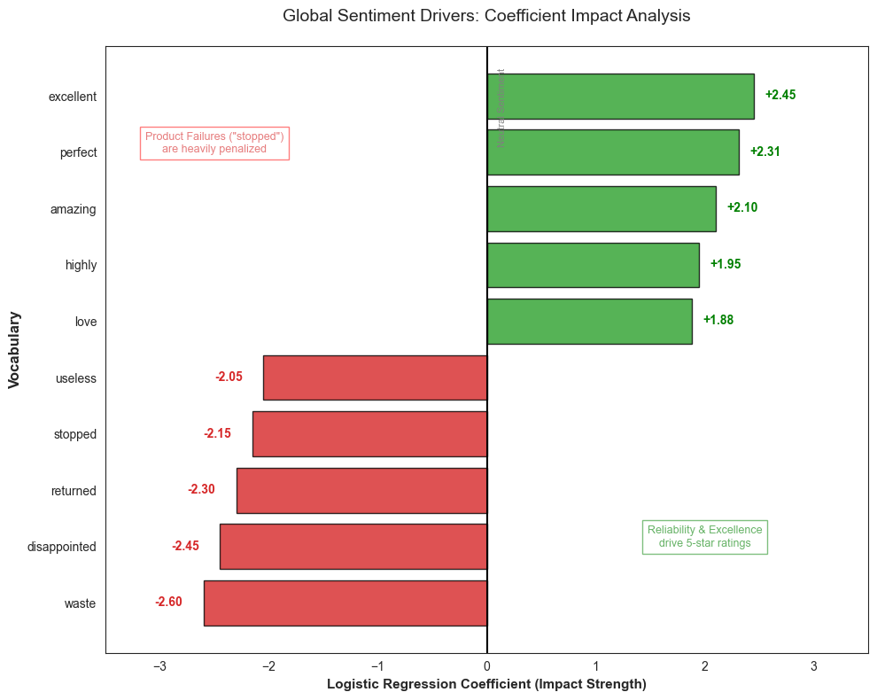
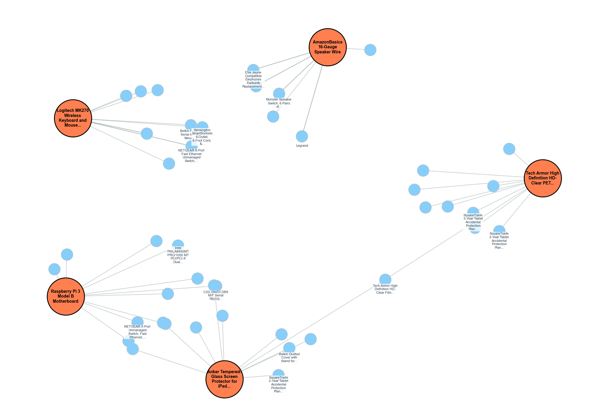

# 🛒 Amazon Electronics Reviews Analytics
by **[Vito Marco Rubino](https://www.linkedin.com/in/vitomarcorubino/)** \
MSc in Data Science – University of Bari Aldo Moro \
*Course Project: Big Data Management and Analytics – A.Y. 2025-2026*

## 📌 Overview

E-commerce environments generate massive volumes of heterogeneous data, where valuable insights are often hidden within unstructured user feedback.
This project implements a **distributed Big Data architecture** to ingest, process, and analyze over **20 million interaction records** from the [Amazon Electronics](https://cseweb.ucsd.edu/~jmcauley/datasets/amazon_v2/) category.

The system integrates **MongoDB** (NoSQL) and **Apache Spark** to bridge the gap between Data Engineering and Advanced Analytics, delivering Market Intelligence, NLP-based sentiment drivers, and Graph Network analysis.

## 🗂 Repository Structure
- 📂 [data/](data)                      # Schema, images, final report and presentation
  - 📄 [report.pdf](data/Report.pdf)    # Final Project Report
  - 📄 [presentation.pdf](data/Presentation.pdf)    # Final Project Presentation
- 📂 [src/main/](src/main/)               # Data Ingestion (Python) and Spark ETL and Modeling
- 📄 [build.sbt](build.sbt)             # Spark/Scala dependencies

## 📐Analytical Models
The project deploys four distinct processing pipelines:

* **Semantic Reasoning (NLP):**
    * *Logistic Regression* for Sentiment Analysis
    * *Word2Vec* for synonym discovery (e.g., `screen` $\approx$ `display`).
    * *Differential Set Analysis* to extract distinctive product features:
    $$Distinctive_{feat} = Words_{Pos} \setminus (Words_{Pos} \cap Words_{Neg})$$.

* **Graph Dynamics:**
    * PageRank algorithm on the `also_buy` adjacency graph to measure node centrality.

* **Predictive Modeling:**
    * Collaborative Filtering via **ALS (Alternating Least Squares)** for personalized recommendations.

## 📊 Key Results

### 1. Sentiment Drivers
Logistic Regression coefficients identified that negative sentiment is driven primarily by **functional reliability** (e.g., "stopped", "died") rather than aesthetics.

  

### 2. The "Accessory Centrality"
GraphX analysis overturned the assumption that flagship devices are the network hubs. PageRank scores demonstrated that **low-cost accessories** (cables, SD cards) are the true structural connectors of the market.

  

### 3. Recommendation Accuracy
The Collaborative Filtering model achieved a baseline **RMSE of 1.12** on a 5-star scale, validating the feasibility of personalization on sparse datasets.

| Product Title | Price ($) | Predicted Rating |
| :--- | :--- | :--- |
| Logitech M510 Wireless Mouse | 19.99 | 4.85 |
| Anker 4-Port USB 3.0 Hub | 9.99 | 4.72 |
| WD 2TB Elements Portable Drive | 69.00 | 4.65 |

---

## 🌐 Author
* **Vito Marco Rubino**  
   
